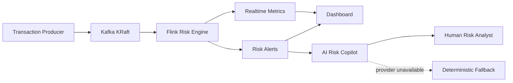

# FinGuard — Realtime Risk Engine + AI Investigation Copilot

FinGuard 是一个面向支付风控场景的工程化 AI 应用项目：**Kafka + Flink 负责实时、确定性的风险检测，AI Risk Copilot 负责告警解释与人工调查辅助**。LLM 被刻意放在硬实时决策链路之外，因此模型失败、超时或不可用时不会阻塞风险检测。

> Portfolio focus: streaming systems, AI application engineering, structured outputs, graceful degradation, PII minimization, evaluation and CI.

## Architecture



### Why hybrid instead of “LLM does fraud detection”

- **Flink rules** own deterministic, low-latency detection, event-time windows, state, deduplication and late-data handling.
- **LLM copilot** turns structured alert evidence into analyst-facing summaries, recommended next actions and investigation steps.
- The model **cannot authorize or reject payments**.
- Raw user/device/merchant IDs are pseudonymized before model calls; raw IP is excluded; nested evidence is recursively minimized.
- Model output is constrained by JSON Schema and falls back to deterministic explanations on missing key, timeout, provider error or parse/schema failure.

## Scope control

This repository intentionally keeps a small runtime surface:

```text
Producer -> one Kafka transaction topic -> Flink -> File Sinks -> Dashboard / AI Copilot
```

The project does **not** include unused PostgreSQL, Hive/HDFS, Grafana, vector databases or Agent frameworks. Those should be introduced only when a concrete query, retrieval, orchestration or observability requirement exists.

## Main capabilities

| Layer | Capability |
|---|---|
| Ingestion | Python producer, synthetic and public AML dataset adapters |
| Messaging | single business Kafka topic, local single-node KRaft |
| Streaming | Flink DataStream, Watermark, windows, keyed state, TTL, deduplication |
| Detection | frequency, amount spike, multi-user device/card, consecutive failure, blacklist rules |
| Reliability | checkpoint boundary, dead-letter output, late-event side output, idempotent alert IDs |
| AI application | FastAPI copilot, OpenAI Responses API, Structured Outputs, prompt versioning |
| AI safety | PII minimization, grounded-context contract, human-in-the-loop, deterministic fallback |
| Evaluation | golden-set action/evidence checks runnable without an API key |
| Observability | AI request/fallback/latency metrics plus Flink/Kafka operational signals |
| Delivery | Docker Compose, Vercel static demo, GitHub Actions Python + Java CI |

## Quick start

```bash
pip install -r requirements.txt
make test
```

Start Kafka/Flink:

```bash
make up
make create-topics
make generate
make submit-job
make produce
```

Start dashboard:

```bash
make dashboard
# http://127.0.0.1:8090
```

Start AI copilot:

```bash
# Optional: export OPENAI_API_KEY=...
make ai
# http://127.0.0.1:8091/docs
```

Without `OPENAI_API_KEY`, the API remains available in deterministic fallback mode. On the local Dashboard, click **AI 调查** on a risk alert to call the Copilot service.

Docker profile:

```bash
docker compose --profile ai up -d ai-copilot
```

## AI API example

`POST /v1/explanations`

```json
{
  "alert": {
    "rule_id": "R006",
    "risk_level": "HIGH",
    "reason": "当前交易设备命中黑名单设备",
    "evidence": {"is_black_device": true}
  },
  "transaction": {
    "amount": 899,
    "currency": "CNY",
    "channel": "APP",
    "user_id": "user-demo",
    "device_id": "device-black-001"
  }
}
```

Response fields include `summary`, `recommended_action`, `confidence`, `key_evidence`, `investigation_steps`, `limitations`, `source`, `prompt_version` and `model`.

## Evaluation

```bash
make ai-eval
```

The deterministic golden set verifies recommended action, evidence coverage and response completeness without external model credentials. A production-grade extension should additionally track grounded-evidence rate, schema-valid rate, action agreement, fallback rate, p95 latency, model cost and analyst acceptance rate.

## Risk rules

| Rule | Description | Level |
|---|---|---|
| R001 | user transaction count > 10 / 1 min | MEDIUM |
| R002 | user amount > CNY 20,000 / 5 min | HIGH |
| R003 | device linked to > 5 users / 10 min | HIGH |
| R004 | card linked to > 3 users / 10 min | HIGH |
| R005 | consecutive failures > 5 | MEDIUM |
| R006 | blacklisted device | HIGH |
| R007 | amount > 5x user historical average | MEDIUM |
| R008 | merchant 5-min amount > 3x historical baseline | HIGH |

## Repository map

```text
ai_service/     FastAPI + LLM/fallback investigation copilot
evals/          golden-set AI evaluation cases
producer/       transaction generation and Kafka producer
flink-job/      Java Flink real-time risk job
dashboard/      risk monitoring UI with AI investigation drawer
tests/          Python tests
docs/           architecture, reliability, AI and interview notes
scripts/        minimal runtime/data build tooling
```

Generated runtime data is intentionally ignored by Git. Use `make generate` and the Flink job to create local samples and sink output.

## Public dashboard

Static portfolio demo:

`https://finguard-realtime-risk-monitor.vercel.app`

The public site contains generated demo data and a clearly labeled static Copilot fallback preview. Real model requests are only made when the local Copilot API is running; no model key is embedded in the static site.

## Engineering docs

- `docs/AI_COPILOT.md`
- `docs/ARCHITECTURE.md`
- `docs/KAFKA_DESIGN.md`
- `docs/FLINK_DESIGN.md`
- `docs/WATERMARK_AND_LATE_DATA.md`
- `docs/STATE_AND_RELIABILITY.md`
- `docs/RISK_RULES.md`
- `docs/INTERVIEW_QA.md`
