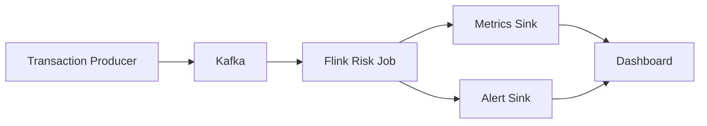

# FinGuard：支付交易实时风控与异常监控平台

本项目面向互联网支付场景，构建 Kafka + Flink 实时交易风控链路，实现交易事件接入、实时窗口统计、状态去重、Watermark 乱序处理、迟到数据旁路输出和风险规则告警。

## 技术栈

Kafka、Flink、Docker Compose、Java、Python、Watermark、Window、Keyed State、Checkpoint、File Sink、PostgreSQL/ClickHouse 可选。

## 架构图



## 目录结构

```text
producer/      Python 事件生成器与 Kafka producer
flink-job/     Java Flink DataStream 风控作业
scripts/       Windows/Unix 本地运行脚本
sql/           可选数据库 sink 表结构和 dashboard 查询
docs/          架构、Kafka、Flink、Watermark、规则、可靠性、面试文档
reports/       样例指标和告警结果
data/          样例事件与本地文件 sink 输出
tests/         Python 单元测试
```

## Kafka Topic 设计

| Topic | 说明 |
|---|---|
| `payment_transaction_events` | 支付交易主事件流 |
| `payment_user_events` | 登录、绑卡、设备变更等用户行为事件 |
| `payment_risk_alerts` | 实时风险告警输出 |
| `payment_realtime_metrics` | 实时指标输出 |
| `payment_late_events` | 迟到事件输出 |
| `payment_dead_letter_events` | 解析失败或非法事件输出 |

## 事件 Schema 示例

```json
{
  "event_id": "evt-sample-001",
  "transaction_id": "txn-sample-001",
  "user_id": "user-demo-hf",
  "account_id": "acct-demo-hf",
  "card_id": "card-demo-001",
  "merchant_id": "merchant-demo-001",
  "device_id": "device-demo-001",
  "ip": "10.1.1.10",
  "province": "Shanghai",
  "city": "Shanghai",
  "amount": 128.5,
  "currency": "CNY",
  "payment_method": "BANK_CARD",
  "transaction_type": "PAY",
  "transaction_status": "SUCCESS",
  "event_time": "2026-05-10T02:00:00Z",
  "process_time": "2026-05-10T02:00:01Z",
  "channel": "APP",
  "app_version": "6.2.1",
  "is_black_device": false,
  "is_black_card": false,
  "risk_label": "NORMAL"
}
```

完整 schema：`producer/event_schema.json`。

## 风控规则

| Rule ID | 规则 | 风险等级 |
|---|---|---|
| R001 | 同一用户 1 分钟内交易次数超过 10 次 | MEDIUM |
| R002 | 同一用户 5 分钟内交易金额超过 20,000 元 | HIGH |
| R003 | 同一设备 10 分钟内关联超过 5 个用户 | HIGH |
| R004 | 同一银行卡 10 分钟内关联超过 3 个用户 | HIGH |
| R005 | 同一用户连续支付失败超过 5 次 | MEDIUM |
| R006 | 黑名单设备交易 | HIGH |
| R007 | 当前交易金额超过用户历史平均交易金额 5 倍 | MEDIUM |
| R008 | 同一商户 5 分钟收款金额超过历史均值 3 倍 | HIGH |

## 本地运行

Windows 11 建议：

- Docker Desktop 开启 WSL2 backend
- CPU 4 核以上
- 内存 8GB 以上
- Java 17、Maven、Python 3.10+

安装 Python 依赖：

```powershell
conda activate finguard-risk-monitor
pip install -r requirements.txt
```

也可以从项目的 Conda 环境文件重建：

```powershell
conda env create -f environment.yml
conda activate finguard-risk-monitor
```

启动基础服务：

```powershell
make up
make create-topics
```

生成样例事件：

```powershell
make generate
```

提交 Flink 作业：

```powershell
make submit-job
```

启动 Producer：

```powershell
make produce
```

或一键启动基础链路：

```powershell
.\scripts\run_all.ps1
```

常用命令：

```text
make up             启动 Kafka/Flink
make down           停止服务
make create-topics  创建 Kafka topics
make generate       生成样例事件
make produce        按 QPS 写 Kafka
make submit-job     打包并提交 Flink 作业
make logs           查看容器日志
make clean          清理本地运行数据
make test           运行 Python 和 Java 测试
```

端口：

| 服务 | 地址 |
|---|---|
| Kafka | `localhost:9092` |
| Flink UI | `http://localhost:8081` |
| PostgreSQL 可选 | `localhost:5432` |

## Producer 示例

```powershell
python producer/generate_transactions.py --count 1000 --output data/sample_events/transactions.json
python producer/kafka_producer.py --bootstrap-server localhost:9092 --topic payment_transaction_events --qps 50 --duration 300
python producer/kafka_producer.py --mode abnormal --abnormal-rate 0.15 --qps 100 --duration 600
python producer/kafka_producer.py --mode late --count 200
```

支持正常交易、高频交易、大额交易、异地交易、黑名单设备、连续失败支付、商户收款突增、乱序事件、迟到事件、重复事件、高峰流量。

## 企业级数据与智能大屏

项目已扩展企业级公开 AML 数据接入，默认数据源为 Hugging Face `aaronzeller/small-aml-data`，约 1.45GB、约 6.9M 笔合成金融交易，低于 40GB 上限。

下载企业级数据，支持断点续传：

```powershell
python scripts/download_enterprise_dataset.py
```

转换为 FinGuard 交易事件：

```powershell
python producer/enterprise_dataset.py --limit 200000
```

用企业级数据写入 Kafka：

```powershell
python producer/enterprise_kafka_producer.py --bootstrap-server localhost:9092 --topic payment_transaction_events --qps 500 --limit 100000
```

启动沉浸式三维智能大屏：

```powershell
python dashboard/server.py --port 8090
```

访问：

```text
http://localhost:8090
```

如果要把企业级数据放到你本机 `HADOOP_HOME` 对应的 HDFS：

```powershell
.\scripts\enterprise_ingest_to_hdfs.ps1
```

详细说明见 `docs/ENTERPRISE_SCALE_UPGRADE.md`。

## 样例告警结果

```json
{
  "rule_id": "R006",
  "rule_name": "黑名单设备交易",
  "risk_level": "HIGH",
  "reason": "当前交易设备命中黑名单设备",
  "user_id": "user-demo-black",
  "device_id": "device-black-001",
  "amount": 899.0,
  "evidence": {
    "device_id": "device-black-001",
    "is_black_device": "true",
    "source": "event_flag"
  }
}
```

更多样例见 `reports/risk_alert_sample.md`。

## 样例实时指标

```json
{
  "metric_name": "channel_success_rate_5m",
  "dimensions": {
    "channel": "APP",
    "success": "488",
    "total": "520"
  },
  "value": 0.938461,
  "count": 520
}
```

更多样例见 `reports/realtime_result_sample.md`。

## Flink 核心技术点

- Watermark：基于 `event_time`，默认容忍 60 秒乱序。
- Window：滚动窗口实现 1 分钟交易次数，滑动窗口实现 5/10 分钟风险统计。
- State：`ValueState` 保存去重标记、连续失败次数、历史均值。
- State TTL：防止高基数用户、设备、商户状态无限增长。
- Checkpoint：保存 Kafka offset、窗口状态、Keyed State、Sink 提交状态。
- Side Output：迟到事件写入 `data/late_events/`，非法事件写入 `data/output/dead_letter/`。
- Exactly-once 边界：Kafka 到 Flink 状态可做到 exactly-once；文件输出和下游读取需要幂等配合。
- 幂等 Sink：告警使用稳定 `alert_id`，数据库扩展可用主键 upsert。

## 项目难点

- 乱序事件：用 Watermark 容忍短时间乱序。
- 迟到数据：严重迟到走 side output，不污染实时窗口。
- 重复事件：基于 `event_id` TTL 状态去重。
- 高峰流量：Producer 支持 `--qps` 和 `--mode peak`。
- 状态膨胀：高基数状态设置 TTL。
- 消息积压：通过 Kafka lag、Flink backpressure、Checkpoint 观察。
- 反压：重点排查 Sink、热点 key、窗口大小和 TaskManager 资源。
- 结果一致性：文档中明确 exactly-once、at-least-once 和幂等边界。

## 简历写法

FinGuard：基于 Kafka + Flink 构建支付交易实时风控与异常监控平台，设计交易事件模型、Kafka Topic、Flink DataStream 作业和 8 类风控规则；实现事件时间 Watermark、滚动/滑动窗口、Keyed State、State TTL、Checkpoint、event_id 去重、迟到数据旁路输出和文件 Sink，支持 Windows 11 + Docker Compose 本地端到端运行。

## 3 分钟面试讲解稿

FinGuard 是我设计的一个支付实时风控项目，目标是模拟互联网支付平台的交易事件流，并用 Kafka + Flink 做秒级风险识别。整体链路是 Python Producer 生成交易事件写入 Kafka，Flink 作业消费 `payment_transaction_events`，基于事件时间做 Watermark 和窗口计算，再把实时指标、风险告警、迟到事件和死信事件写入文件 Sink。

项目里我实现了 8 条规则，包括用户 1 分钟高频交易、5 分钟大额交易、设备多用户关联、银行卡多用户关联、连续失败支付、黑名单设备、用户金额突增和商户收款突增。规则不只是简单 if 判断，有些是窗口聚合，有些是 Keyed State，例如连续失败次数和用户历史均值。

这个项目的重点是流处理语义。我用 `event_time` 做事件时间，用 Watermark 容忍乱序，用 side output 处理严重迟到事件，用 `event_id` 状态做去重，用 Checkpoint 保证 Kafka offset 和 Flink 状态恢复一致。同时我在文档里明确说明，Kafka 到 Flink 状态可以做到 exactly-once，但文件输出和下游消费还需要 `alert_id` 幂等配合，不能夸大全链路绝对 exactly-once。

本地运行方面，我提供了 Docker Compose、Makefile 和 PowerShell 脚本，Windows 11 + Docker Desktop + WSL2 可以启动 Kafka 和 Flink，并通过 Flink UI 查看作业、Checkpoint 和反压。如果继续扩展，我会把规则配置做成广播流，引入 ClickHouse 或 PostgreSQL 做 Dashboard，并补充更完整的压测和告警降噪。

## 文档索引

- `docs/ARCHITECTURE.md`
- `docs/KAFKA_DESIGN.md`
- `docs/FLINK_DESIGN.md`
- `docs/WATERMARK_AND_LATE_DATA.md`
- `docs/RISK_RULES.md`
- `docs/STATE_AND_RELIABILITY.md`
- `docs/INTERVIEW_QA.md`
- `docs/REFERENCES.md`
- `docs/ENTERPRISE_SCALE_UPGRADE.md`
