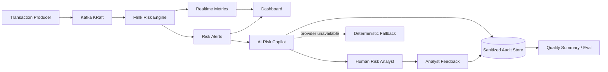

# FinGuard — Realtime Risk Engine + AI Investigation Copilot

FinGuard 是一个面向支付风控场景的工程化 AI 应用项目：**Kafka + Flink 负责实时、确定性的风险检测，AI Risk Copilot 负责告警解释、人工调查和反馈闭环**。LLM 被刻意放在硬实时决策链路之外，因此模型失败、超时或不可用时不会阻塞风险检测。

> Portfolio focus: streaming systems, AI application engineering, structured outputs, graceful degradation, PII minimization, auditability, human feedback and CI.

## Architecture



### Why hybrid instead of “LLM does fraud detection”

- **Flink rules** own deterministic, low-latency detection, event-time windows, state, deduplication and late-data handling.
- **LLM copilot** turns structured alert evidence into analyst-facing summaries, recommended actions and investigation steps.
- **Human feedback closes the loop**: analysts can mark true positive / false positive / uncertain and whether the AI recommendation was accepted.
- The model **cannot authorize or reject payments**.
- Raw identifiers are pseudonymized before model calls or audit writes; raw IP is excluded; nested evidence is recursively minimized.
- Model output is constrained by JSON Schema and falls back to deterministic explanations on missing key, timeout, provider error or parse/schema failure.
- Repeated provider failures open a small circuit breaker so the service stops hammering an unhealthy upstream while continuing deterministic fallback.

## Scope control

The runnable path intentionally stays small:

```text
Producer -> one Kafka transaction topic -> Flink -> File Sinks -> Dashboard / AI Copilot
                                                     AI Copilot -> SQLite audit + analyst feedback
```

SQLite is not a new platform dependency: it is the Python-standard-library persistence layer for one concrete responsibility—auditable investigation/feedback state. The project still does **not** include unused PostgreSQL, Hive/HDFS, Grafana, vector databases, Celery or Agent frameworks.

## Main capabilities

| Layer | Capability |
|---|---|
| Ingestion | Python producer, synthetic and public AML dataset adapters |
| Messaging | single business Kafka topic, local single-node KRaft |
| Streaming | Flink DataStream, Watermark, windows, keyed state, TTL, deduplication |
| Detection | frequency, amount spike, multi-user device/card, consecutive failure, blacklist rules |
| Reliability | checkpoint boundary, dead-letter output, late-event side output, idempotent alert IDs |
| AI application | FastAPI Copilot, structured outputs, prompt versioning, deterministic fallback |
| AI reliability | provider timeout/retry boundary, circuit breaker, liveness/readiness endpoints |
| AI safety | PII minimization, sanitized audit records, human-in-the-loop |
| Feedback loop | request trace, analyst verdict, recommendation acceptance, idempotent feedback update |
| Evaluation | offline golden-set + online acceptance/false-positive quality summary |
| Observability | request/fallback/latency/feedback metrics plus Flink/Kafka operational signals |
| Delivery | focused runtime image, non-root AI container, Docker Compose, Vercel demo, GitHub Actions CI |

## Quick start

```bash
pip install -r requirements.txt
make test
```

Start Kafka/Flink:

```bash
make up
make create-topics
make generate
make submit-job
make produce
```

Start dashboard and AI Copilot:

```bash
make dashboard
make ai
# dashboard: http://127.0.0.1:8090
# API docs:  http://127.0.0.1:8091/docs
```

Without `OPENAI_API_KEY`, the API stays available in deterministic fallback mode. On the local Dashboard, click **AI 调查** on a risk alert, inspect the structured explanation, then record the human verdict.

Docker profile:

```bash
docker compose --profile ai up -d ai-copilot
```

## AI investigation contract

`POST /v1/explanations` returns a `request_id`, input fingerprint, latency and structured explanation. The same request can then be reviewed through `POST /v1/feedback`.

Useful operational endpoints:

```text
GET /healthz
GET /readyz
GET /metrics
GET /v1/investigations/{request_id}
GET /v1/quality/summary
```

The audit store persists **sanitized context only**. It does not persist raw transaction payloads.

## Evaluation

```bash
make ai-eval
```

Two quality loops now exist:

1. **Offline regression gate**: golden cases verify expected actions/evidence before merge.
2. **Online human feedback**: recommendation acceptance and false-positive rates are calculated from analyst verdicts.

The repository does not claim measured p95/p99 latency, token cost or analyst time savings until those numbers are produced by an actual deployment/load test.

## Risk rules

| Rule | Description | Level |
|---|---|---|
| R001 | user transaction count > 10 / 1 min | MEDIUM |
| R002 | user amount > CNY 20,000 / 5 min | HIGH |
| R003 | device linked to > 5 users / 10 min | HIGH |
| R004 | card linked to > 3 users / 10 min | HIGH |
| R005 | consecutive failures > 5 | MEDIUM |
| R006 | blacklisted device | HIGH |
| R007 | amount > 5x user historical average | MEDIUM |
| R008 | merchant 5-min amount > 3x historical baseline | HIGH |

## Repository map

```text
ai_service/     FastAPI + LLM/fallback + audit/feedback service
evals/          golden-set AI evaluation cases
producer/       transaction generation and Kafka producer
flink-job/      Java Flink real-time risk job
dashboard/      risk monitoring UI with AI investigation/feedback drawer
tests/          Python tests
docs/           architecture, operations, reliability, AI and interview notes
scripts/        minimal runtime/data tooling
```

Generated runtime/audit data is intentionally ignored by Git.

## Public dashboard

Static portfolio demo:

`https://finguard-realtime-risk-monitor.vercel.app`

The public site contains generated demo data and a clearly labeled static Copilot fallback preview. Real model requests and analyst feedback are local-only; no model key is embedded in the static site.

## Engineering docs

- `docs/AI_COPILOT.md`
- `docs/ARCHITECTURE.md`
- `docs/OPERATIONS.md`
- `docs/KAFKA_DESIGN.md`
- `docs/FLINK_DESIGN.md`
- `docs/WATERMARK_AND_LATE_DATA.md`
- `docs/STATE_AND_RELIABILITY.md`
- `docs/RISK_RULES.md`
- `docs/INTERVIEW_QA.md`
