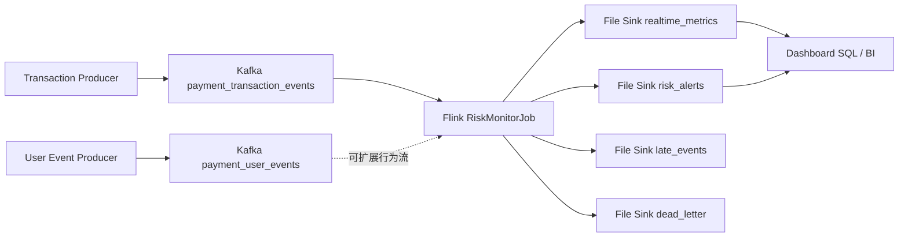

# FinGuard 实时架构设计

## 1. 总体目标

FinGuard 面向互联网支付交易场景，构建一条从事件模拟、Kafka 接入、Flink 实时计算到文件 Sink 输出的实时风控链路。系统重点展示事件时间、Watermark、窗口、状态、Checkpoint、迟到数据旁路、重复事件处理和风险告警。

## 2. 架构图



最小可运行链路：

```text
producer/kafka_producer.py -> Kafka -> RiskMonitorJob -> data/output + data/alerts + data/late_events
```

## 3. Kafka Topic

| Topic | 说明 | 默认分区 | Key 建议 |
|---|---|---:|---|
| `payment_transaction_events` | 支付交易主事件流 | 6 | `user_id` |
| `payment_user_events` | 登录、绑卡、设备变更等用户行为事件 | 3 | `user_id` |
| `payment_risk_alerts` | 实时风险告警输出，可选 Kafka Sink | 3 | `alert_id` |
| `payment_realtime_metrics` | 实时指标输出，可选 Kafka Sink | 3 | `metric_name` |
| `payment_late_events` | 迟到事件输出，可选 Kafka Sink | 3 | `event_id` |
| `payment_dead_letter_events` | 解析失败或非法事件输出，可选 Kafka Sink | 3 | `event_id` |

当前代码默认使用文件 Sink，Kafka 输出 Topic 作为后续扩展预留。

## 4. Flink 作业拓扑

```text
KafkaSource<String>
  -> ParseTransactionProcessFunction
  -> assignTimestampsAndWatermarks
  -> keyBy(event_id) + EventDeduplicateFunction
  -> LateEventRouterFunction
  -> Rule Streams
  -> Union Alerts
  -> Metrics Streams
  -> FileSink
```

核心模块：

- `ParseTransactionProcessFunction`：JSON 解析与基础字段校验，非法数据进入 dead letter。
- `EventDeduplicateFunction`：基于 `event_id` 的 24 小时 TTL 去重。
- `LateEventRouterFunction`：对落后当前 Watermark 的事件做 side output。
- 窗口规则：R001、R002、R003、R004、R008。
- 状态规则：R005、R007、R008 历史均值判断。
- 文件 Sink：告警、指标、迟到、死信分别落盘。

## 5. 时间语义

FinGuard 以 `event_time` 作为事件时间。Flink 使用 bounded out-of-orderness Watermark：

```text
watermark = 当前观察到的最大 event_time - watermark-seconds
```

默认乱序容忍为 60 秒，可通过作业参数调整：

```text
--watermark-seconds 60
```

## 6. 状态与窗口

| 类型 | 使用点 |
|---|---|
| Tumbling Window | R001 用户 1 分钟交易次数 |
| Sliding Window | R002 用户 5 分钟金额、R003 设备 10 分钟用户数、R004 卡 10 分钟用户数、R008 商户 5 分钟金额 |
| Keyed State | event_id 去重、连续失败次数、用户历史均值、商户历史窗口均值 |
| State TTL | 去重 24 小时、连续失败 6 小时、用户均值 30 天、商户均值 14 天 |
| Side Output | 迟到事件、死信事件 |

## 7. 输出路径

| 输出 | 默认路径 |
|---|---|
| 实时指标 | `data/output/realtime_metrics/` |
| 风险告警 | `data/alerts/risk_alerts/` |
| 迟到事件 | `data/late_events/` |
| 死信事件 | `data/output/dead_letter/` |

在 Docker 中这些路径映射到：

```text
file:///opt/finguard/data/...
```

## 8. 扩展方向

- 将文件 Sink 替换为 PostgreSQL、ClickHouse 或 Kafka Sink。
- 将黑名单和规则配置改为广播流。
- 引入 Schema Registry 和 Avro/Protobuf。
- 将历史画像迁移到外部特征服务或离线画像表。
- 引入 Grafana 展示 `sql/dashboard_queries.sql` 中的指标。
