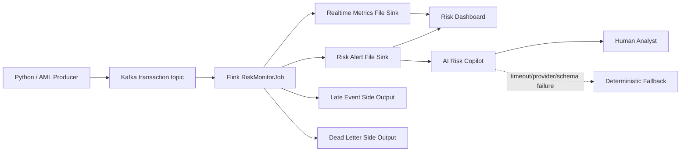

# FinGuard 架构设计

## 1. 目标

FinGuard 面向支付交易风险监控，采用“确定性实时检测 + AI 调查辅助”的双层架构：

- Kafka + Flink 负责交易流接入、事件时间处理、状态计算、风险规则和可靠性边界；
- AI Risk Copilot 负责把结构化告警转换为面向人工分析员的解释、证据摘要和调查步骤；
- LLM 不参与支付授权，不影响 Flink 主链路可用性。

## 2. 运行架构



本地 Docker 只运行必要基础设施：Kafka KRaft、Flink JobManager/TaskManager；AI Copilot 通过 `ai` profile 按需启动。

## 3. Flink 主链路

```text
KafkaSource<String>
  -> parse + schema validation
  -> event-time watermark
  -> event_id deduplication
  -> late-event routing
  -> rule streams
  -> alert / metric union
  -> checkpoint-aware file sinks
```

核心能力：

- `ParseTransactionProcessFunction`：解析与字段校验；非法事件进入 dead letter。
- `EventDeduplicateFunction`：基于 `event_id` + TTL 的状态去重。
- `LateEventRouterFunction`：严重迟到事件旁路。
- 窗口规则：R001、R002、R003、R004、R008。
- 状态规则：R005、R007 及商户历史基线。
- File Sink：告警、指标、迟到、死信分离输出。

## 4. AI Copilot 边界

AI 服务只接受风险告警和最小化交易上下文：

```text
RiskAlert + minimized transaction context
  -> identifier pseudonymization / IP removal
  -> versioned prompt
  -> JSON-Schema structured output
  -> analyst-facing explanation
```

失败路径不会抛给风控主链路：缺少 API Key、超时、供应商错误、JSON 解析错误或 Schema 校验失败时，返回确定性规则解释。

AI 输出包含：

- `summary`
- `recommended_action`
- `confidence`
- `key_evidence`
- `investigation_steps`
- `limitations`
- `source`
- `prompt_version`

## 5. 时间与状态语义

FinGuard 使用 `event_time` 作为事件时间，默认 Watermark 容忍 60 秒乱序。

| 类型 | 使用点 |
|---|---|
| Tumbling Window | R001 用户 1 分钟交易次数 |
| Sliding Window | R002 用户金额、R003 设备关联用户、R004 卡关联用户、R008 商户金额 |
| Keyed State | event_id 去重、连续失败、用户/商户历史基线 |
| State TTL | 控制高基数状态增长 |
| Side Output | 迟到事件、死信事件 |

## 6. 一致性与故障边界

- Kafka Source offset 与 Flink state 随 Checkpoint 一起恢复。
- File Sink 使用 checkpoint-aware 提交方式。
- 告警使用稳定 `alert_id` 支持下游幂等。
- AI 服务位于检测链路之后，其失败只影响“解释能力”，不影响规则检测结果。
- 项目不宣称跨任意第三方系统的全局 exactly-once。

## 7. 为什么不继续加组件

当前版本有意不引入数据库、Hive/HDFS、Grafana、Schema Registry、向量数据库或 Agent 框架，因为这些组件没有进入当前核心业务闭环。只有当明确出现持久查询、规则配置中心、检索增强或多步骤工具调用需求时，再按需求引入。
