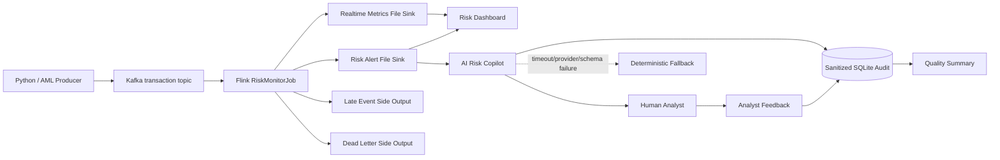

# FinGuard 架构设计

## 1. 目标

FinGuard 面向支付交易风险监控，采用“确定性实时检测 + AI 调查辅助 + 人工反馈”的三段式架构：

- Kafka + Flink 负责交易流接入、事件时间、状态计算、风险规则与可靠性边界；
- AI Risk Copilot 把结构化告警转换为解释、证据摘要和调查步骤；
- Human Analyst 对 AI 建议做最终判定，反馈进入审计存储用于后续质量评估；
- LLM 不参与支付授权，不影响 Flink 主链路可用性。

## 2. 运行架构



本地 Docker 只运行必要基础设施：Kafka KRaft、Flink JobManager/TaskManager；AI Copilot 通过 `ai` profile 按需启动。SQLite 是内置审计状态，不引入独立数据库服务。

## 3. Flink 主链路

```text
KafkaSource<String>
  -> parse + schema validation
  -> event-time watermark
  -> event_id deduplication
  -> late-event routing
  -> rule streams
  -> alert / metric union
  -> checkpoint-aware file sinks
```

核心能力包括 schema validation、event_id + TTL 去重、Watermark/迟到旁路、8 条窗口/状态规则以及 checkpoint-aware File Sink。

## 4. AI Copilot 主链路

```text
RiskAlert + optional transaction context
  -> identifier pseudonymization / IP removal / nested evidence sanitation
  -> versioned prompt + JSON-Schema output
  -> LLM or deterministic fallback
  -> request_id + input fingerprint
  -> sanitized audit record
  -> analyst verdict + recommendation acceptance
```

### Provider reliability

- SDK timeout and bounded retry protect request latency;
- repeated provider failures open a process-local circuit breaker;
- while the circuit is open, requests immediately use deterministic fallback;
- `/healthz` exposes the circuit state;
- provider failure never propagates into Flink detection.

### Audit boundary

Copilot persistence stores only:

- pseudonymized/minimized context;
- structured explanation;
- request metadata (`request_id`, fingerprint, prompt version, source, latency);
- analyst verdict and whether the recommendation was accepted.

Raw transaction payloads and raw identifiers are not persisted by the Copilot audit store.

## 5. Human feedback and evaluation

The analyst feedback record is keyed by `request_id`, so repeated submissions are idempotent updates rather than duplicate rows. This enables online quality indicators such as:

- recommendation acceptance rate;
- false-positive rate among reviewed cases;
- fallback share;
- average explanation latency;
- comparison by future prompt versions.

Offline golden-set tests remain the merge-time regression gate. Online feedback is complementary evidence, not a replacement for curated evaluation.

## 6. Health and operational surfaces

- `/healthz`: process/model/circuit liveness information;
- `/readyz`: audit-store readiness;
- `/metrics`: Prometheus text exposition;
- `/v1/quality/summary`: application-level quality summary;
- `docs/OPERATIONS.md`: failure diagnosis and reset procedures.

## 7. 时间、状态与一致性边界

FinGuard uses `event_time` with a default 60-second out-of-order Watermark. Kafka source offsets and Flink state recover through Checkpoint; File Sink uses checkpoint-aware submission; stable `alert_id` supports downstream idempotency.

The AI service is downstream of detection. If the provider is unhealthy, only explanation quality changes. If the audit store is unhealthy, `/readyz` fails and explanation requests return 503 rather than emitting an unaudited recommendation.

## 8. 为什么不继续加组件

当前版本有意不引入 PostgreSQL、Redis、Celery、Hive/HDFS、Grafana、Schema Registry、向量数据库或 Agent 框架。只有出现明确的多实例共享状态、异步任务、检索增强、规则配置中心或监控平台需求时，再用可证明的需求引入对应组件。
