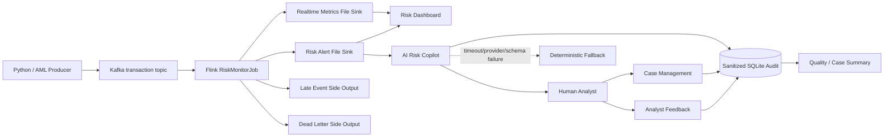

# FinGuard 架构设计

## 1. 目标

FinGuard 面向支付交易风险监控，采用“确定性实时检测 + AI 调查辅助 + 案件管理 + 人工反馈”的四段式架构：

- Kafka + Flink 负责交易流接入、事件时间、状态计算、风险规则与可靠性边界；
- AI Risk Copilot 把结构化告警转换为解释、证据摘要和调查步骤；
- Case Management 将需要持续跟踪的调查转成有负责人、优先级、SLA 和状态机的案件；
- Human Analyst 对 AI 建议做最终处置，反馈进入审计存储用于后续质量评估；
- LLM 不参与支付授权，不影响 Flink 主链路可用性。

## 2. 运行架构



本地 Docker 只运行必要基础设施：Kafka KRaft、Flink JobManager/TaskManager；AI Copilot 通过 `ai` profile 按需启动。SQLite 是内置审计与案件状态，不引入独立数据库服务。

## 3. Flink 主链路

```text
KafkaSource<String>
  -> parse + schema validation
  -> event-time watermark
  -> event_id deduplication
  -> late-event routing
  -> rule streams
  -> alert / metric union
  -> checkpoint-aware file sinks
```

核心能力包括 schema validation、event_id + TTL 去重、Watermark/迟到旁路、8 条窗口/状态规则以及 checkpoint-aware File Sink。

## 4. AI Copilot 主链路

```text
RiskAlert + optional transaction context
  -> identifier pseudonymization / IP removal / nested evidence sanitation
  -> versioned prompt + JSON-Schema output
  -> LLM or deterministic fallback
  -> request_id + input fingerprint
  -> sanitized audit record
  -> optional case creation
  -> analyst disposition / recommendation acceptance
```

### Provider reliability

- SDK timeout and bounded retry protect request latency；
- repeated provider failures open a process-local circuit breaker；
- while the circuit is open, requests immediately use deterministic fallback；
- `/healthz` exposes the circuit state；
- provider failure never propagates into Flink detection。

### Audit boundary

Copilot persistence stores only:

- pseudonymized/minimized context；
- structured explanation；
- request metadata (`request_id`, fingerprint, prompt version, source, latency)；
- analyst verdict and whether the recommendation was accepted；
- case workflow metadata such as status, priority, assignee, SLA and event history。

Raw transaction payloads and raw identifiers are not persisted by the Copilot audit store.

## 5. Case Management 语义

案件不是每条告警的强制副本。只有需要持续跟踪、分派或 SLA 管理的调查才升级为 Case。

状态机：

```text
OPEN -> INVESTIGATING -> RESOLVED
  ^          |              |
  |----------+              |
             <--- REOPEN ---+
```

约束：

- 同一 `request_id` 只能建立一个案件，重复建案返回同一 Case；
- 默认优先级由风险等级映射；
- SLA：Critical 15 分钟、High 60 分钟、Medium 4 小时、Low 24 小时；
- 更新请求必须携带 `expected_version`；
- 版本不一致返回 HTTP 409，防止两个分析员静默覆盖彼此修改；
- 结案必须提供 `resolution_verdict` 与 `action_taken`；
- 如果结案同时提供 `accepted_recommendation`，案件结果和 AI 质量反馈在同一 SQLite transaction 中写入；
- 重新打开案件会撤销上一版最终反馈标签，但 `case_events` 保留所有历史状态变化。

## 6. Human feedback and evaluation

Analyst feedback is keyed by `request_id`, so repeated submissions are idempotent updates rather than duplicate rows. This enables online quality indicators such as:

- recommendation acceptance rate；
- false-positive rate among reviewed cases；
- fallback share；
- average explanation latency；
- open/investigating/SLA-breached case counts；
- comparison by future prompt versions。

Offline golden-set tests remain the merge-time regression gate. Online feedback is complementary evidence, not a replacement for curated evaluation.

## 7. Health and operational surfaces

- `/healthz`: process/model/circuit liveness information；
- `/readyz`: audit-store readiness；
- `/metrics`: Prometheus text exposition including case counters［
- `/v1/quality/summary`: application-level AI quality summary；
- `/v1/cases/summary`: active case/SLA workload summary；
- `docs/OPERATIONS.md`: failure diagnosis and reset procedures。

## 8. 时间、状态与一致性边界

FinGuard uses `event_time` with a default 60-second out-of-order Watermark. Kafka source offsets and Flink state recover through Checkpoint；File Sink uses checkpoint-aware submission；stable `alert_id` supports downstream idempotency。

The AI service is downstream of detection. If the provider is unhealthy, only explanation quality changes. If the audit store is unhealthy, `/readyz` fails and explanation requests return 503 rather than emitting an unaudited recommendation.

Case updates use application-level optimistic concurrency. This is intentionally separate from Flink's event-stream consistency boundary.

## 9. 当前部署边界

The SQLite case/audit store is appropriate for the current single-instance local/portfolio runtime. It is **not** presented as a horizontally scalable shared database. A managed relational database should only replace it when there is a concrete multi-instance/shared-state requirement.

Authentication/authorization is also intentionally outside the local-only deployment boundary; Docker ports bind to `127.0.0.1`. Exposing this service to a network would require identity, RBAC and secrets management before deployment.

## 10. 为什么不继续加组件

当前版本有意不引入 PostgreSQL、Redis、Celery、Hive/HDFS、Grafana、Schema Registry、向量数据库或 Agent 框架。只有出现明确的多实例共享状态、异步任务、检索增强、规则配置中心或监控平台需求时，再用可证明的需求引入对应组件。
